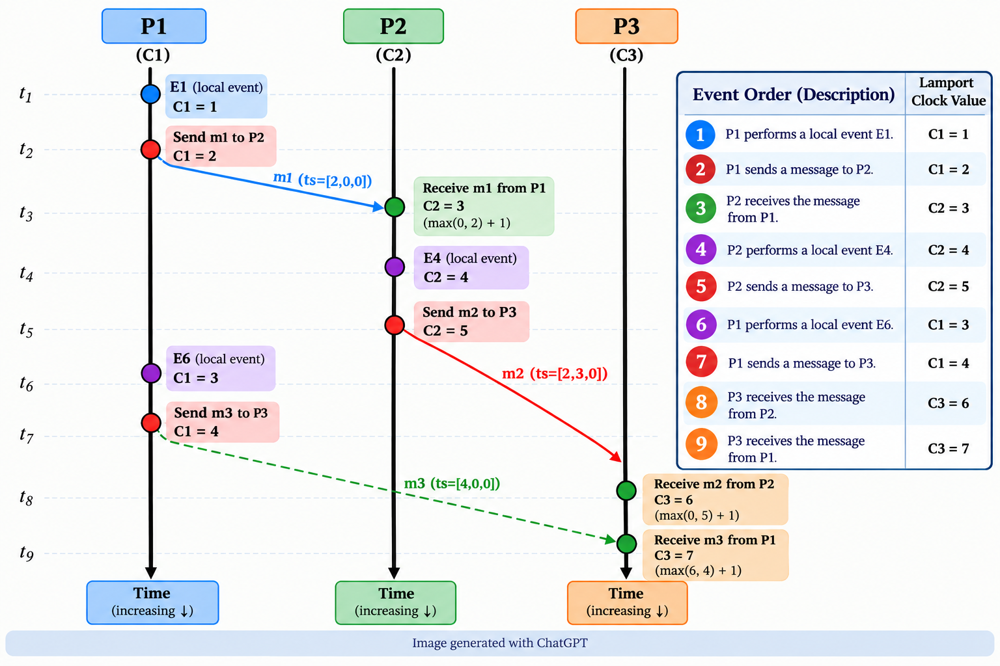

# 20CYS402 - Distributed Systems and Cloud Computing
   <br/>

## Lab#7A - Lamport Logical Clock


### 1. Objective

Implement **Lamport's Logical Clock Algorithm** to establish the logical ordering of events in a distributed system.

The implementation must contain:

- At least **3 simulated distributed processes**
- Independent logical clocks for each process
- Local events
- Inter-process message passing
- Send and receive events
- Lamport timestamp calculation
- Causal ordering of events
- Demonstration of concurrent events

Students may implement the experiment using **any programming language of their choice**.

> **Note:** Docker is **not required** for this experiment. The distributed processes may be simulated using functions, classes, objects, threads, or separate program instances.


### 2. Expected Architecture

The distributed system should contain at least three processes:

```text
                 Distributed System

        +-----------------------+
        |       Process P1      |
        |   Logical Clock: C1   |
        |                       |
        | Local / Send / Receive|
        +----------+------------+
                   |
                   | Message M1
                   v
        +-----------------------+
        |       Process P2      |
        |   Logical Clock: C2   |
        |                       |
        | Local / Send / Receive|
        +----------+------------+
                   |
                   | Message M2
                   v
        +-----------------------+
        |       Process P3      |
        |   Logical Clock: C3   |
        |                       |
        | Local / Send / Receive|
        +-----------------------+
```

Each process must maintain its **own logical clock**.

Initially:

```text
P1 = 0
P2 = 0
P3 = 0
```

### 3. Learning Outcomes

After completing this experiment, students should be able to:

1. Understand the concept of logical time in distributed systems.
2. Implement Lamport's Logical Clock algorithm.
3. Maintain independent logical clocks for multiple processes.
4. Assign timestamps to local, send, and receive events.
5. Establish causal ordering between distributed events.
6. Understand the limitations of scalar logical clocks.
7. Identify concurrent events.
8. Compare Lamport Logical Clocks with Vector Clocks.

### Part A — Distributed Process Simulation

#### 4. Create Distributed Processes

Implement at least **three processes**:

| Process | Initial Logical Clock |
|---|---:|
| `P1` | 0 |
| `P2` | 0 |
| `P3` | 0 |

The processes may be represented using:

- Classes
- Objects
- Functions
- Threads
- Separate program instances
- Any other suitable programming construct

For example:

```text
Process P1 → Clock C1
Process P2 → Clock C2
Process P3 → Clock C3
```

The processes do not need to run on separate physical machines.


### Part B — Lamport Logical Clock

#### 5. Logical Clock

Each process maintains an integer logical clock.

Initially:

```text
C1 = 0
C2 = 0
C3 = 0
```

The logical clock represents the **logical ordering of events**, not actual physical time.


#### 6. Rule 1 — Local Event

Before executing a local event:

```text
C = C + 1
```

For example:

```text
Initial Clock = 0

LOCAL EVENT

Clock = 0 + 1
      = 1
```

Therefore:

```text
Local Event Timestamp = 1
```


#### 7. Rule 2 — Send Event

Before sending a message:

```text
C = C + 1
```

The updated clock value is attached to the message.

For example:

```text
P1 Clock = 1

P1 performs SEND

P1 Clock = 2
```

The message contains:

```text
Message ID        : M1
Sender            : P1
Receiver          : P2
Lamport Timestamp : 2
```


#### 8. Rule 3 — Receive Event

When a process receives a message with timestamp `T`, update its clock using:

```text
C = max(C, T) + 1
```

For example:

```text
P2 Clock = 0

Received Timestamp = 2

P2 Clock = max(0, 2) + 1
         = 3
```

Therefore:

```text
Receive Event Timestamp = 3
```

### Part C — Event Types

#### 9. Required Event Types

The implementation must support at least the following:

| Event Type | Description |
|---|---|
| `LOCAL` | Event occurring within a process |
| `SEND` | Process sends a message |
| `RECEIVE` | Process receives a message |

Example:

```text
LOCAL(P1)

SEND(P1, P2)

RECEIVE(P2, P1)
```

### Part D — Exercise Scenario

#### 10. Implement the Following Event Sequence

Use three processes:

```text
P1
P2
P3
```

Initially:

```text
P1 Clock = 0
P2 Clock = 0
P3 Clock = 0
```

Execute the following sequence:

```text
1. P1 performs a local event E1.

2. P1 sends a message to P2.

3. P2 receives the message from P1.

4. P2 performs a local event E4.

5. P2 sends a message to P3.

6. P1 performs a local event E6.

7. P1 sends a message to P3.

8. P3 receives the message from P2.

9. P3 receives the message from P1.
```

<p align="center">
  
</p>

The timestamps must be **calculated by your program**.

Do not hard-code the expected timestamps.


### Part E — Message Representation

#### 11. Message Structure

Every message should contain at least:

```text
Message ID
Sender
Receiver
Lamport Timestamp
```

For example:

```text
Message ID        : M1
Sender            : P1
Receiver          : P2
Lamport Timestamp : 2
```

Students may implement messages using any suitable data structure.

For example:

```text
Class
Structure
Object
Dictionary / Map
JSON
Record
```


### Part F — Required Operations

#### 12. Local Event

Implement an operation equivalent to:

```text
local_event(P1)
```

It should:

1. Increment the process clock.
2. Assign the timestamp.
3. Record the event.
4. Display the event.


#### 13. Send Message

Implement an operation equivalent to:

```text
send_message(P1, P2)
```

It should:

1. Increment the sender's clock.
2. Create a message.
3. Attach the Lamport timestamp.
4. Deliver the message to the destination process.
5. Record the send event.


#### 14. Receive Message

Implement an operation equivalent to:

```text
receive_message(P2, message)
```

It should:

1. Read the timestamp from the message.
2. Compare it with the receiver's current clock.
3. Apply:

```text
C = max(C, T) + 1
```

4. Record the receive event.
5. Display the updated timestamp.


### Part G — Required Output

#### 15. Event Log

The program should produce a clear event log similar to:

```text
====================================================
             LAMPORT LOGICAL CLOCK
====================================================

Process    Event    Type       Timestamp
----------------------------------------------------
P1         E1       LOCAL          1
P1         E2       SEND           2
P2         E3       RECEIVE        3
P2         E4       LOCAL          4
P2         E5       SEND           5
P1         E6       LOCAL          3
P1         E7       SEND           4
P3         E8       RECEIVE        6
P3         E9       RECEIVE        5
----------------------------------------------------
```

The values above are illustrative.

Your program must calculate the timestamps dynamically.

---

### Part H — Causal Ordering

#### 16. Demonstrate Causal Ordering

Lamport Logical Clocks satisfy:

\[
a \rightarrow b \implies L(a)<L(b)
\]

For example:

```text
P1 SEND M1
      |
      v
P2 RECEIVE M1
```

If:

```text
L(SEND) = 2
```

then:

```text
L(RECEIVE) > 2
```

Demonstrate at least **two causal relationships** in your implementation.

Record them in a table:

| Event A | Event B | Timestamp A | Timestamp B |
|---|---|---:|---:|
| P1 SEND M1 | P2 RECEIVE M1 | | |
| P2 SEND M2 | P3 RECEIVE M2 | | |


### Part I — Concurrent Events

#### 17. Demonstrate Concurrent Events

Consider two processes that do not communicate:

```text
P1:  E1 -------- E2


P2:  E3 -------- E4
```

There is no message or causal relationship between the events of P1 and P2.

Create at least one example of concurrent events.

Answer:

> Can Lamport timestamps alone determine whether two events are concurrent?

Explain your answer.


### Part J — Programming Language

#### 18. Language Choice

Students may use **any programming language of their choice**.

Examples include:

- Python
- C
- C++
- Java
- JavaScript
- TypeScript
- Go
- Rust
- C#
- Kotlin

The programming language itself will not be the primary evaluation criterion.

The implementation must correctly demonstrate the Lamport Logical Clock algorithm.


### Part K — Communication / Simulation

#### 19. Process Communication

Since this experiment does not require Docker, students may simulate communication using any suitable mechanism.

Examples:

```text
Function calls
Objects / Classes
Shared data structures
Queues
Threads
Sockets
REST APIs
Message-passing mechanisms
```

At minimum, the implementation must clearly demonstrate that a timestamp is transferred from the sending process to the receiving process.


### Part K — Questions to Answer

#### 20. Lab Questions

1. What problem does Lamport's Logical Clock solve?

2. Why can't physical clocks alone reliably establish event ordering in a distributed system?

3. Why does every process maintain its own logical clock?

4. What happens to the clock when a local event occurs?

5. What happens to the clock before sending a message?

6. What happens when a process receives a message with timestamp `T`?

7. Why is the following expression used during message reception?

```text
max(local_clock, received_timestamp) + 1
```

8. Can two different events have the same Lamport timestamp?

9. Can Lamport clocks identify concurrent events?

10. What are the limitations of Lamport Logical Clocks?

11. How does a Vector Clock improve upon Lamport Logical Clocks?

12. What is the difference between a physical clock, Lamport Logical Clock, and Vector Clock?
